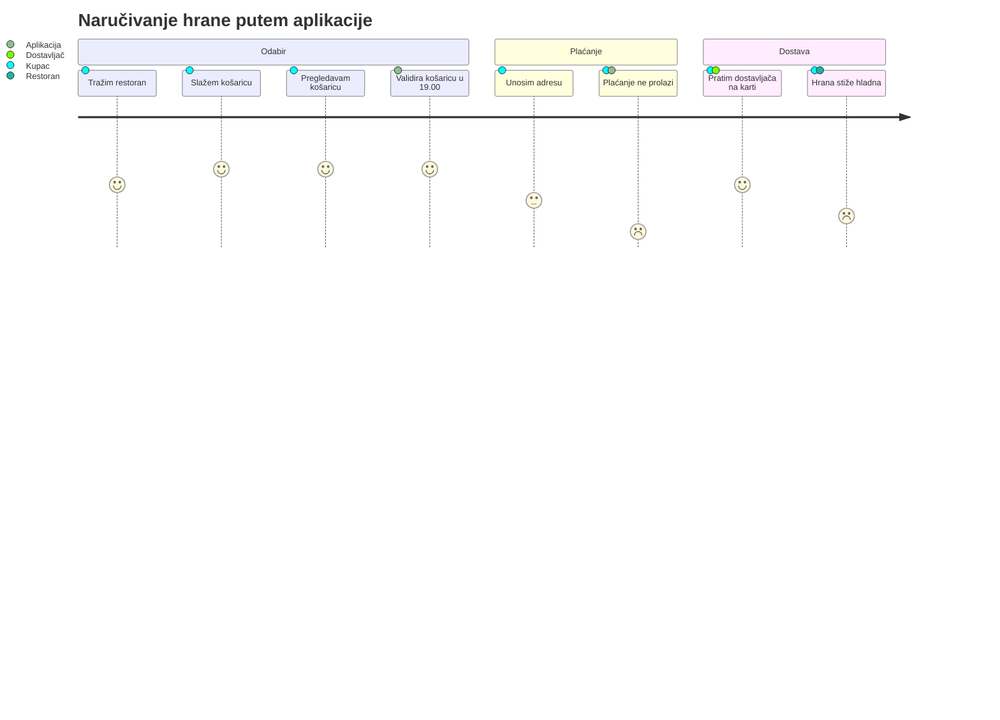
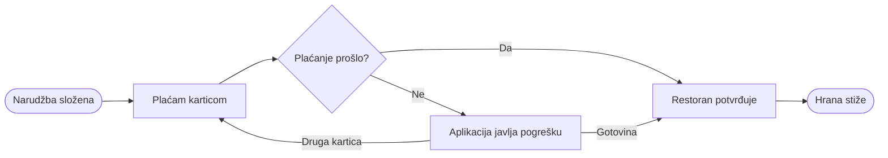
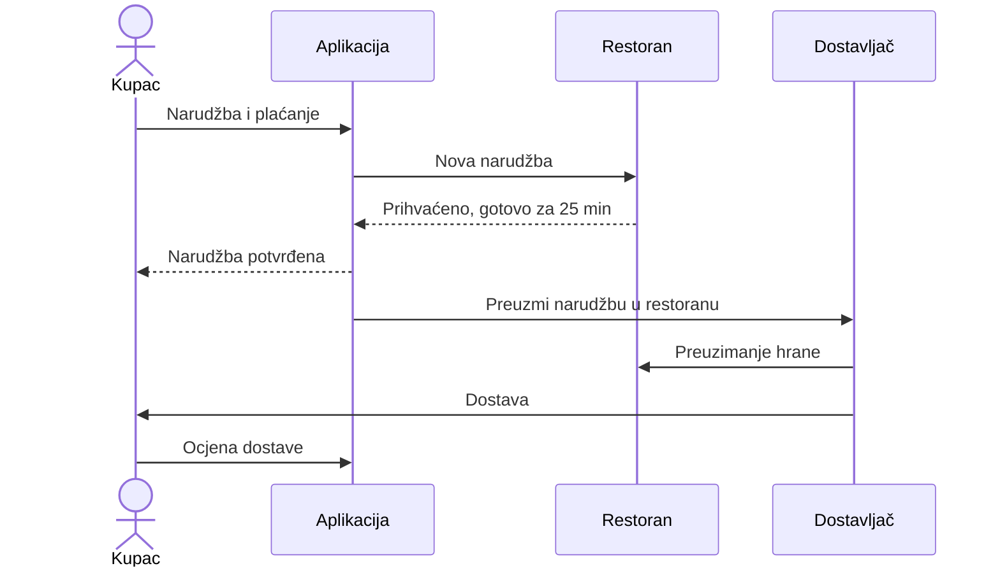
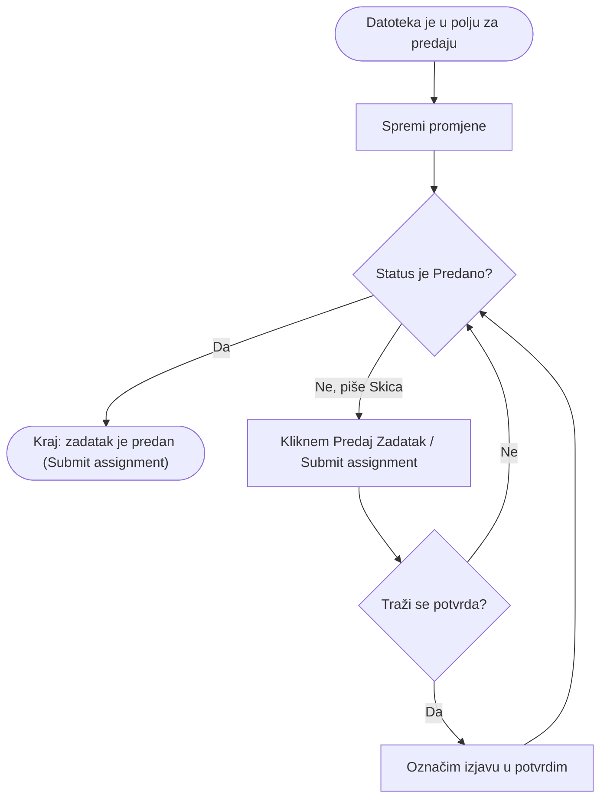

# Dokumentacija sustava

---

## Rad u Mermaidu

---

```mermaid
journey
  title Naručivanje hrane putem aplikacije
  section Odabir
    Tražim restoran: 4: Kupac
    Slažem košaricu: 5: Kupac
    Pregledavam košaricu: 5: Kupac
    Validira košaricu u 19.00: 5: Aplikacija
  section Plaćanje
    Unosim adresu: 3: Kupac
    Plaćanje ne prolazi: 1: Kupac, Aplikacija
  section Dostava
    Pratim dostavljača na karti: 4: Kupac, Dostavljač
    Hrana stiže hladna: 2: Kupac, Restoran
```

---

```mermaid
flowchart LR
  A([Narudžba složena]) --> E[Plaćam karticom]
  E --> F{Plaćanje prošlo?}
  F -->|Da| G[Restoran potvrđuje]
  F -->|Ne| H[Aplikacija javlja pogrešku]
  H -->|Druga kartica| E
  H -->|Gotovina| G
  G --> K([Hrana stiže])
```

---

```mermaid
sequenceDiagram
  actor K as Kupac
  participant A as Aplikacija
  participant R as Restoran
  participant D as Dostavljač
  K->>A: Narudžba i plaćanje
  A->>R: Nova narudžba
  R-->>A: Prihvaćeno, gotovo za 25 min
  A-->>K: Narudžba potvrđena
  A->>D: Preuzmi narudžbu u restoranu
  D->>R: Preuzimanje hrane
  D->>K: Dostava
  K->>A: Ocjena dostave
```

---

```mermaid
flowchart TD
  A([Datoteka je u polju za predaju]) --> B[Spremi promjene]
  B --> C{Status je Predano?}
  C --> |Da| K(["Kraj: zadatak je predan (Submit assignment)"])
  C --> |Ne, piše Skica| D[Kliknem Predaj Zadatak / Submit assignment] 
  D --> E{Traži se potvrda?}
  E --> |Da| F[Označim izjavu u potvrdim]
  F --> C
  E --> |Ne| C
```
